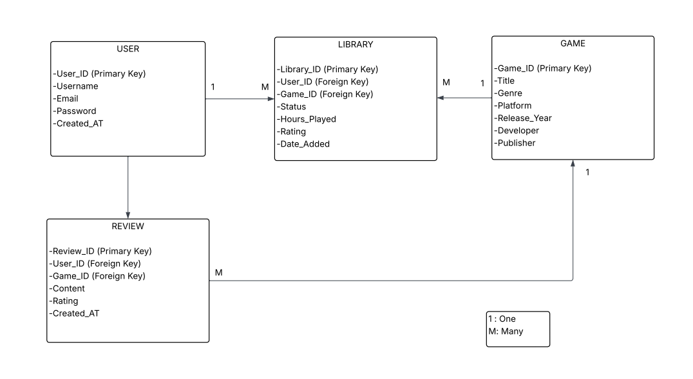

# Game Library Tracker

## Project Overview

The Game Library Tracker is a web application that allows users to manage and organize their personal video game collections. Users can track the games they own, monitor their progress, and keep records of completed or ongoing games.

The purpose of this application is to provide a simple way for users to manage their game library in one centralized system.

## Intended Users

This application is designed for gamers who want to organize their game collections across multiple platforms such as PC, PlayStation, Xbox, and Nintendo Switch.

## Features

- User registration and login system  
- Create, read, update, and delete user accounts  
- Add games to a personal library  
- Update game status (Playing, Completed, Backlog, Dropped)  
- Track hours played and game ratings  
- Remove games from the library  
- View game details (title, genre, platform, release year, developer, publisher)  
- Optional: create and manage game reviews  

## Main Entities

- User  
- Game  
- Library (user-game relationship)  
- Review (optional feature)

## Purpose

The application solves the problem of disorganized game collections by allowing users to keep all their games, progress, and ratings in one place.

